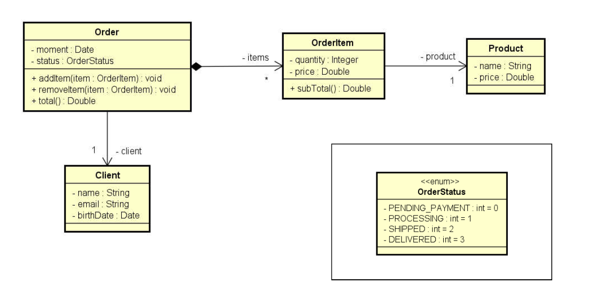
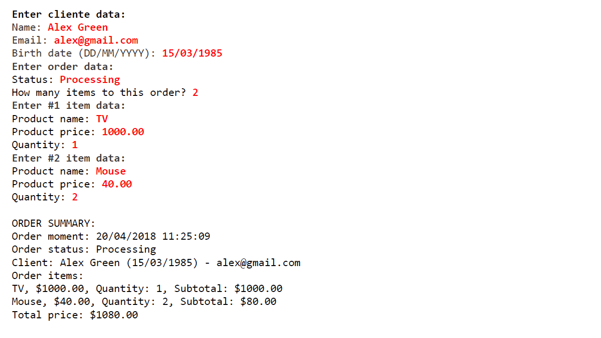

# Order System

Um pequeno sistema de compras e pedidos de uma loja feito para entender melhor sobre enumeração e composição, além de aplicar fundamentos de listas, por conta das ligações um para vários. Também mostra a utilização do StringBuilder para a criação de string mais complexas.

