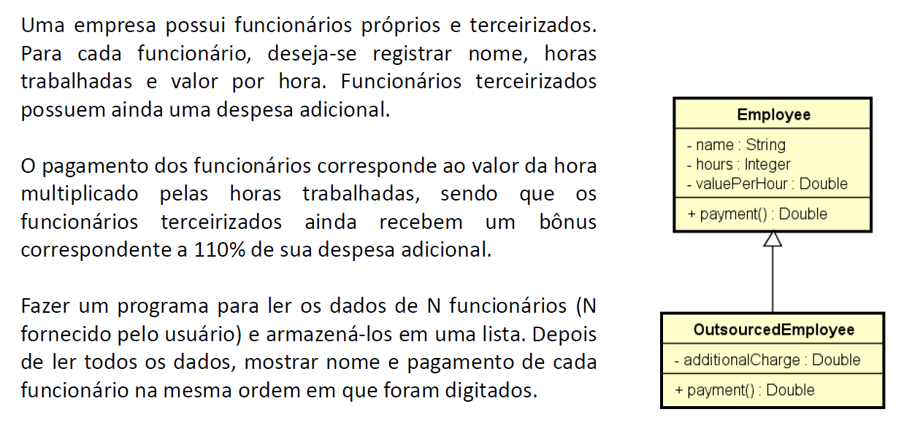
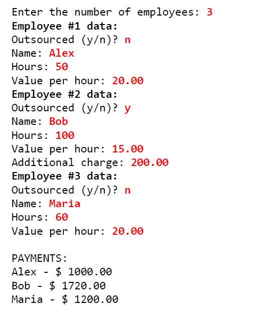

# Employee System

Um pequeno sistema usado para entender questões como Herança e Polimorfismo em C#. Também aplicando questões como Upcasting, Downcasting, sobreposição de métodos e selamento de classes e métodos.

