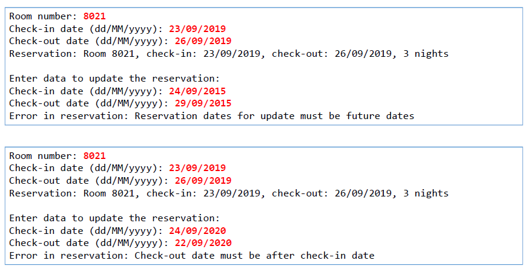

# Hotel System

Pequeno sistema de reservas para aplicar as ideias de tratamento de exceções (try catch, finally) e criação de exceções personalizadas.

##Examples

Exemplos de entradas para capturar os erros

